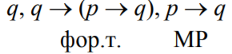
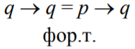
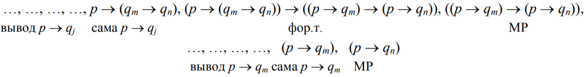

# Глава 1. Высказывания

## §1. Алгебра высказывания

<u>Опр.</u> **Алфавит** - множество символов. **Слово** - конечная последовательсность символов. **Язык** - любое множество слов над заданным алфавитом.

Наш алфавит состоит из символов: $\{x_1, x_2, ... , x_n\} $ и связок $\{\land, \lor, \neg, \rightarrow, \leftrightarrow, (, )\}$ 

<u>Опр.</u> **Свободный моноид** - множество всех слов над данным алфавитом с операцией конкатенации. 

Слова в нашем языке называются формулами. *Какие слова являются формулами?*:

1. Предметный символ.
2. Если $p $ и $q$ - некоторые формулы, то ($\neg p$), $(p \land q), (p \lor q), (p \rightarrow q), (p \leftrightarrow q)$ тоже формулы.
3. Других формул нет.

<u>Опр.</u> Язык, состоящий из этих формул, называется язык **формальной логики**.

Теперь каждой формуле поставим в соответствие функцию.

Рассмотрим поле из двух элементов: кольцо вычетов по модулю 2: $\{ 0, 1 \}$. рассмотрим 2 многочлена: $x^2$ и $x$. Они различны как многочлены. Но они в этом поле совпадают как функции. 

Если есть какие-то формальные объекты, и мы хотим их интерпретировать как функции, вообще говоря, они не обязательно могут быть инъективны. 

Каждой формуле мы сопоставим булеву функцию. Предметные символы интерпретируем как аргументы, связки как операции, таким образом каждая формула задает булеву функцию. 

<u>Опр.</u> $\phi: $ формула $\rightarrow$ функция - **булева интерпретация формулы**. Обозначается $BInt$. Например, если есть формула $p$, то $BInt(p)$ - ее булева интерпретация.

>  Две функции равны $\iff$ их значения совпадают для любых аргументов.

<u>Опр.</u> Пусть $p$ и $q$ две формулы. Будем говорит, что они находятся в отношении $\equiv$, если $BInt(p) = BInt(q)$. Это отношение эквивалентности и называется "**равносильностью**".

Все формулы разбиваются на классы эквивалентных функций. 

(там был какой-то пример, но я его не понял)

> **Упражнение.** Доказать, что для любых формул $p$ и $q$: 
>
> $BInt(\neg p) = \neg BInt(p) \\ BInt(p \land q) = BInt(p) \land BInt(q) \\ BInt(p \lor q) = BInt(p) \lor BInt(q) \\ BInt(p \rightarrow q) = BInt(p) \rightarrow BInt(q) \\ BInt(p \leftrightarrow q) = BInt(p) \leftrightarrow BInt(q)$  
>
> "Доказывать я его не хочу, я думаю, что вы и сами докажете"

<u>Опр.</u> Пусть $r$ встречается в записи формулы $p$. Пусть есть формула $r'$, равносильная $r$. Формула $p'$ получается заменой формулы $r$ на формулу $r'$. Получается формула $p'$. Говорят, что формула $p'$ получена из формулы $p$ подстановкой вместо формулы $r$ формулы $r'$. (подформула)

<u>Теорема 1</u>. Пусть $p$ - формула, а $r$ - подформула $p$. Если $r' \equiv r$, то $p' \equiv p$.  

> **Доказательство**. Будем вести индукцией по количеству связок в формуле $p$ без учета связок в формуле $r$.
>
> - Б.И. $n = 0: p = r$. Понятно, что если $p'$ заменим на $r'$, то $p' \equiv p$.
>
> - Ш.И. Для $< n$ уже доказано, рассмотрим случай с $n$ связок. Ясно, что есть последняя связка, после которой появились внешние скобки. 
>
>  1. Пусть $p = \neg p_1$. Если в $p_1$ заменим $r$ на $r'$, то получим $p'$, Тогда $p_1 = p'_1$. Тогда и $p \equiv p'$. 
>
>  2. Пусть $p = p_1 \land q_1$ 
>
>     а) $r$ подформула $p$. У $p_1 $и $q_1$ количество связок меньше. $p'_1 \equiv p$. $BInt(p) = Bint(p_1 \land q_1) = BInt(p_1) \land BInt(q_1) = BInt(p'_1) \land BInt(q'_1). = BInt(p'_1 \land q_1)$
>
>     б) $r_1 подможество q_1, рассматривается аналогично.$

>  "Мы подготовили некоторый язык, теперь давайте начнем о нем высказываться."

5 предложений:

1. Земля вращается вокруг Солнца
2. Солнце вращается вокруг Земли
3. Работа адронного коллайдера приведет к гибели Земли
4. Прямоугольник - это четырехугольник, у которого все уголы прямы!
5. Не стой под стрелой.

>  "Не бизон, а базон, тупой."

<u>Опр.</u> Вычисление значения булевой функции, соответствующей формуле для заданного набора значений аргументов, называется **интерпретацией этой формулы**. 

<u>Опр.</u> Формула называется **тавтологией**, если она принимает значение "1" при любой интерпретации. 

<u>Опр</u>. Формула называется **противоречием**, если при любой интерпретации она принимает значение "0".

<u>Теорема 2.</u> $p \equiv q  \Leftrightarrow  p \leftrightarrow q$  - тавтология 

> **Доказательство.** 
>
> $p \equiv q \Leftrightarrow BInt(p) = BInt(q) \Leftrightarrow BInt(p \leftrightarrow q) = 1$ 

<u>Теорема 3.</u> 

1. Формула $q$ - логическоре следствие $p_1, p_2, ... , p_n  \Leftrightarrow p_1 \land p_2 \land ... \land p_n \rightarrow q$ - **тавтология**
2. Формула $q$ - логическое следствие $\Leftrightarrow p_1 \land p_2 \land.... \land p_n \land \neg q$  - **противоречие**  

> -- Доказательства тривиальны. 
>
> -- Так напиши!

<u>Опр.</u> **Высказывание** - повествовательное предложение, о котором можно сказать истинно оно или ложно.

> Идея записывать высказывания формулами принадлежить Джорджу Булю и Де Моргану. Решение логических уравнений - задача, которую поставил Дж. Буль.

> Аристотель заметил, что люди часто делают "выводы". Из истинности одного высказывая зависит истинность второго (Солнце зашло и на улице стало темно) 

<u>Опр.</u> Говорят, что $q$ является **логическим следствием** $p_1, p_2, .... p_n$, если при любой интерпретации, когда значения этих формул равно $1$, $q$ тоже равно $1$.  Это обозначают так: $\{p_1, p_2, ..., p_n\} \models q$.

## §2. Исчисление логики высказываний

> Первое дошедшее до нас сочинение по формальной логике — «Первая Аналитика» Аристотеля (384-322 гг. до нашей эры). В нём рассматриваются основы силлогистики — правила вывода одних высказываний из других.  Так из высказываний «Все люди смертны» и «Сократ — человек» можно сделать вывод, что «Сократ смертен». 
>
> Аристотель родился в 322 г. до н.э., а в 330 г. до н.э. родился Евклид. 
>
> Евклид предложил другой подход к тому, как получать истинные утверждения. Аристотель и
> мы вслед за ним говорим, что истинность конкретных утверждений – это забота конкретных
> наук, а мы только манипулируем с этими утверждениями посредством логических связок(хоть говорил не так, но смысл таков).
>
> Евклид, будучи математиком, понимал эту проблему глубже, чем какой-то философ
> Аристотель. Во-первых, он говорил, что нам нужны некоторые утверждения, истинность
> которых мы принимаем безоговорочно. Во-вторых, нам нужны правила, по которым мы из этих
> утверждений будем получать новые истинные утверждения.
>
> Формализуем подход Евклида.

Есть формальный язык (его слова которого мы договорились называть формулами).

Фиксируем некоторое множество формул. Их мы будем называть **аксиомами**.

Фиксируем некоторое множество функций, определённых на множестве формул, со значениями снова в множестве формул. Они не обязаны быть всюду определёнными. Мы будем называть их **правилами вывода**.

У нас есть:

- некий **язык** из формул
- набор формул (**аксиомы**)
- **Правила вывода** (из наших формул получать другие формулы) - по существу это функция, которая по набору формул получает некоторую другую формлу: $\varphi(p_1, p_2, ..., p_n) = q$

Такая тройка называется **аксиоматической системой**. 

<u>Опр</u>. Если $\varphi$ – некоторое правило вывода, а формула $q = \varphi(p_1, p_2, …, p_n)$, то
формулу $q$ называют непосредственным следствием формул $p_1, p_2, …, p_n$ , полученным с
помощью правила $\varphi$.

Обычно правила выводы пишут так:  $\frac{p_1, p_2, ..., p_n}{q}$ (по $n$ формулам ставится соответсвие формула $q$).

<u>Опр.</u> Формула называется **выводимой** в данной аксиоматической системе, если

1. Она *аксиома* или 
2. *получена из выведенных формул* по какому-либо правилу вывода
3. других выводимых формул нет.

<u>Опр.</u> Выводимая формула, несовпадающая с аксиомой, называется **формальной теоремой** (в данной аксиоматической системе).

> Эпитет «формальная» мы будем применять для того, чтобы отличать их от теорем нашего
> курса.
>
> А чего мы хотим? Строя аксиоматическую систему, мы всегда будем хотеть три вещи.
>
> 1. Приняв аксиомы за истинные утверждения, мы должны быть уверены, что среди выводимых утверждений не будет ложных. Это называют **непротиворечивостью системы**.
> 2. Хорошо бы, чтобы любое истинное утверждение было теоремой. Это называется **полнотой системы**.
> 3. Хорошо бы иметь алгоритм, позволяющий для любой формулы определять, теорема она или нет. Это называется **алгоритмической разрешимостью**.
>
> Мечтать не вредно.

<u>Опр.</u> Невозможность получить ложное утверждение из истины называется **непротиворечивостью данной системы**.

> Мы еще не говорили о том, что значит "аксиомы истины". Если говорить формально, то из наших аксиом вывода мы не можем получить формулу и ее отрицание. 

<u>Опр.</u> **Непротиворечивой системой** называется система, если в ней нельзя вывести формулу и ее отрицание.

<u>Опр.</u> **Выводимость формулы** означает, что для вывода формулы мы использщуем ранее выведенные формулы. 

<u>Опр.</u> Если всякая тавтология выводима, то теорема называется **полной**.

>  Существует ли алгоритм, позволяющий распознавать выводимые формулы? 

<u>Опр.</u> **Теория называется алгоритмически-разрешимой**, если для любой формулы существует алгоритм, позволяющий определить, выводима эта формула или нет

### Аксиомы логики высказываний

> Давайте строить аксиоматическую систему для логики высказываний.
>
> Язык мы определили в предыдущем параграфе.
>
> Система аксиом может быть выбрана по-разному. Её состав определяется двумя факторами.
>
> 1. Во-первых, количеством связок в языке. Из теоремы Поста следует, что при построении языка высказываний можно было бы обойтись только связками $\neg$ и $\rightarrow$. Тогда было бы достаточно трёх аксиом, чтобы построить непротиворечивую, полную и разрешимую теорию логики высказываний. Нам же ещё требуются аксиомы, которые описывают логическую зависимость между другими связками.
> 2. Во-вторых, мы не боремся за независимость аксиом, т.е. вполне возможно, что какие-то аксиомы на самом деле являются теоремами. Но на доказательство этих теорем требуется время, а у нас его не так много.

Список аксиом делится на 5 групп по принципу связок:

1. $x_1 \rightarrow (x_2 \rightarrow x_1)​$

   $(x_1 \rightarrow (x_2 \rightarrow x_3)) \rightarrow ((x_1 \rightarrow x_2) \rightarrow (x_1 \rightarrow x_3))$

2. $x_1 \land x_2 \rightarrow x_1$

   $x_1 \land x_2 \rightarrow x_2$

   $((x_1 \rightarrow x_2) \rightarrow ((x_1 \rightarrow x_3) \rightarrow (x_1 \rightarrow x_2 \land x_3))$

3. $x_1 \rightarrow x_1 \lor x_2$

   $x_2 \rightarrow x_1 \lor x_2$

   $(x_1 \rightarrow x_3) \rightarrow ((x_2 \rightarrow x_3) \rightarrow (x_1 \lor x_2 \rightarrow x_3))$

4. $(x_1 \leftrightarrow x_2) \rightarrow (x_1 \rightarrow x_2)$

   $(x_1 \leftrightarrow x_2) \rightarrow (x_2 \rightarrow x_1)$

   $(x_1 \rightarrow x_2) \rightarrow ((x_2 \rightarrow x_1 ) \rightarrow (x_1 \leftrightarrow x_2))$

5. $x_1 \rightarrow \neg (\neg x_1)$

   $\neg (\neg x_1) \rightarrow x_1$

   $(x_1 \rightarrow x_2) \rightarrow (\neg x_2 \rightarrow \neg x_1)$

### Правила вывода

1. **Правило подстановки**. Пусть $p$ и $q$ - некоторые формулы. Если в записи $p$ имеется предметный символ $x_n$, то все вхождения этого символа в формулу $p$ заменяем на формулу $q$. результат такой замены будем обозначать $S_q^{x_n}(p)$. Тогда правило подстановки согласно нашим договоренностям запишется так: $\frac{p, q, x_n}{S_q^{x_n}(p)}$ 

   > Блин, а хз как записать большую дробь. Я знаю, что Tex в typora работает на mathjax. Мб кто-то найдет, как это сделать.  

2. **Правило заключения**. Его мы сразу запишем в договорном виде: $\frac{x_1, x_1 \rightarrow x_2}{x_2}$. По латыни это правило называют **modus ponens** (MP).

==26.02.2018==

Напомним, что означает "формула выводима". 

> <u>Опр.</u> Формула называется **выводимой** в данной аксиоматической системе, если
>
> 1. Она *аксиома* или 
> 2. *получена из выведенных формул* по какому-либо правилу вывода
> 3. других выводимых формул нет.

Рассмотрим примеры.

> **Пример 1**. Как вывести формулу? (или, что то же самое, доказать формальную теорему) $x_1 \rightarrow x_1$
>
> $(x_1 \rightarrow (x_2 \rightarrow x_3)) \rightarrow ((x_1 \rightarrow x_2) \rightarrow (x_1 \rightarrow x_3))$ – аксиома.
>
> $(x_1 \rightarrow (x_2 \rightarrow x_1)) \rightarrow ((x_1 \rightarrow x_2) \rightarrow (x_1 \rightarrow x_1))$ – подстановка $x_1$ на место $x_3$.
>
> $((x_1 \rightarrow x_2) \rightarrow (x_1 \rightarrow x_1))$ – MP к аксиоме $x_1 \rightarrow (x_2 \rightarrow x_1)$ и предыдущей формуле.
>
> $(x_1 \rightarrow (x_2 \rightarrow x_1)) \rightarrow (x_1 \rightarrow x_1)$ – подстановка $(x_2 \rightarrow x_1)$ на место $x_2$.
>
> $(x_1 \rightarrow x_1)$ – MP к аксиоме $x_1 \rightarrow (x_2 \rightarrow x_1)$ и предыдущей формуле
>
> **Пример 2**. Доказать, что формула $x_1 \land x_2 \rightarrow x_2 \land x_1$ является формальной теоремой.
>
> $(x_1 \rightarrow x_2) \rightarrow ((x_1 \rightarrow x_3) \rightarrow (x_1 \rightarrow x_2 \land x_3))$ – аксиома
>
> $(x_1 \land x_2 \rightarrow x_2) \rightarrow ((x_1 \land x_2 \rightarrow x_3) \rightarrow (x_1 \land x_2 \rightarrow x_2 \land x_3))$ – подстановка $x_1 \land x_2$ на место $x_1.$
>
> $((x_1 \land x_2 \rightarrow x_3) \rightarrow (x_1 \land x_2 \rightarrow x_2 \land x_3))$ - – MP к аксиоме $x_1 \land x_2 \rightarrow x_2$ и предыдущей формуле.
>
> $(x_1 \land x_2 \rightarrow x_1) \rightarrow (x_1 \land x_2 \rightarrow x_2 \land x_1)$ – подстановка $x_1$ на место $x_3$.
>
> $(x_1 \land x_2 \rightarrow x_2 \land x_1)$ - MP к аксиоме $x_1 \land x_2 \rightarrow x_1$ и предыдущей формуле.
>
> Процесс формального доказательства теорем весьма трудоёмкий. Даже такая простая теорема как $(x1 \rightarrow x1)$ потребовала пяти шагов. А воспринимается она как очевидная, Аристотель считал, что её надо брать за аксиому, т.е. то, что не нуждается в доказательстве. 
>
> Мы сейчас будем изготовлять инструмент, который существенно облегчает доказательство формальных теорем. Для этого нам будет удобно расширять список аксиом, добавляя к ним какие-либо формулы. То множество формул, которые будут добавлены к аксиомам, мы будем обозначать большими греческими буквами. 

**Рассуждения** (даже на теорему не тянет) **о тоже формальной теореме)**. Пусть 

- $t$ - некоторая формула, являющаяся формальной теоремой. 
- $x_n$ - предметный символ, участвующий в записи $t$.
- $q$ - произвольная формула.

Тогда подстановка $S^{x_n}_q(t)$тоже будет формальной теоремой.

>  Почему мы не можем сразу сделать подстановку? Потому что  в $t$ и $q$ могут быть одинаковые переменные. Но в этом случае достаточно заменить в формуле $q$ старые переменные на новые (читай - "переименовать"), ведь у нас их бесконечно много.  А потом, если нам понадобится, можно вернуть старые перменные на место. Этот хак позволяет из наших аксиом получать много-много теорем.

 Пусть у нас есть некое множество формул $\Gamma$. Что такое вывод из системы гамма?

<u>Опр.</u> Мы будем говорить, что **формула $q$ выводима из** $\Gamma$, если есть конечная последовательность $ p_1, p_2, ..., p_n$, такая что $p_n = q$, в которой $\forall p_i \in \Gamma$

1. Она *аксиома* или формальная теорема

2. *Получена из выведенных формул* по **modus ponens** к каким-либо формулам с меньшими номерами. 

3. Запрещены подстановки

   Обозначается $\Gamma \vdash p$.

> В обыденной жизни математика такой вывод называют доказательством.

Далее, у нас (ладно, у Айдара и АГ) была долгая дискуссия по поводу того, как понимать это определение. 

> Элементы $\Gamma$ обычно называют гипотезами.
>
> Разница между определениями "формула выводима" и "формула выводима из $\Gamma$" в том, что в новом определении не сказано про подстановки, в нем можно использовать только modus ponens.
>
> В выводе не из системы аксиом, а просто из системы $\Gamma$ запрещена замена переменных.
>
> По сути, $\Gamma$ - это просто прослойка между формальными тупыми аксиомами и нашим реальным миром. Гамма - это элементарные теоремы, которые следуют из аксиом, которые тяжелы для нашего понимания.
>
> Проблема: пусть есть некая система $\Gamma, p \vdash q$. Верно ли тогда, что $\Gamma \vdash p \rightarrow q$? Или все то, что строили математики долгие годы можно легко разрушить? Ладно, не будем сегодня разрушать мир, просто докажем эту теорему. 
>
> По идее, это просто стандартное доказательство теорем. Принцип такой:  если бла-бла, то бла-бла.

**Теорема дедукции**. Если $\Gamma \cup \{p\} \vdash q$, то $\Gamma \vdash p \rightarrow q$

> Эту теорему доказал французский математик Жак Эрбан в 1930 года, хотя ей пользовался еще Евклид, даже незадумываясь о том, можно ли так делать. Естественно, что вокруг этой теоремы возникли споры о принадлежности. Но да хрен с ними, докажем ее.
>
> **Доказательство.**
>
> Пусть для формулы $q$ есть вывод, т.е. существует последовательность из $\Gamma \cup \{p\}: q_1, q_2, ... , q_n = q$. 
>
> Доказательство проведем индукцией по $n$. 
>
> - **Б.И.** Если $n = 1$, то $q$:
>
>   - либо формальная теорема,
>   - либо формула из $\Gamma$,
>   - либо $q=p$, поскольку MP применять еще не к чему.
>
>   1. $q$ - формальная теорема или формула из $\Gamma$. Вывод строится так:
>
>      
>
>   2. $q = p$. Вывод строится так:
>
>      
>
> - **Ш.И.** Пусть для $k < n$ уже доказано. Рассмотрим $k = n$
>
>    Теперь у нас 4 случая с :
>
>   1. $q$ - формальная теорема
>   2. $q$ - формула из $\Gamma$
>   3. $q = p$
>   4. $q = q_n$ получена по правилу MP из каких-то формул $q_m$ и $q_j$ для $m < n$ и $j < n$. Первые три случая не отличаются от варианта $n = 1$. В четвертом случае $q_j$ должна иметь вид $(q_m \rightarrow q_n)$ (чтобы применить MP!). Поскольку формул $q_m$ и $q_j$ расположены в выводе формулы $q_n$, то все написано перед каждой из них, - это ее вывод из $\Gamma \cup \{p\}$. По П.И. для формул $p \rightarrow q_j = p \rightarrow (q_m \rightarrow q_n)$ и $p \rightarrow q_m$ имеется вывод из $\Gamma$. Пишем теперь вывод формул $p \rightarrow q_n$
>
>   
>
> **треш и угар**

<u>Замечание</u>. Теорема о дедукции резко сокращает процесс доказательства теорем.

## §3 Непротиворечивость, полнота, разрешимость, исчисления высказываний

> "Было просто исчисления высказываний, а сейчас не просто."

#### Непротиворечивость

**Теорема**. Все формальные теоремы являются тавтологиями

> Доказательства на словах.
>
> Это означает, что все формулы не противоречивы. 

#### Полнота

<u>Опр.</u> Пусть есть некая формула $p$, в которой фигурируют формулы $x_1, x_2, ..., x_n$. Возьмем какую-нибудь **интерпретацию** (или реальные значения) $p: (1, 0, ..., 1)$. 

Положим: 

- $q_i = \begin{cases} x_i       & \quad \text{если } x_i \text{ интерпретируется как 1 }\\ \neg x_i       & \quad \text{если } x_i \text{ интерпретируется как 0 } \end{cases}$
- $p' = \begin{cases} p       & \quad \text{если } p \text{ интерпретируется как 1 }\\ \neg p       & \quad \text{если } p \text{ интерпретируется как 0 }\end{cases}$

<u>Лемма 1</u>. При любой фиксированной интерпретации из $\{q_1, q_2, ..., q_n\} \vdash p'$. 

> Для понимания рассмотрим пример:
>
> | $x_1$ | $x_2$ | $p: \neg x_1 \rightarrow x_2$ | $q_1$      | $q_2$      | $p'$                             |
> | ----- | ----- | ----------------------------- | ---------- | ---------- | -------------------------------- |
> | 0     | 0     | 0                             | $\neg x_1$ | $\neg x_2$ | $\neg(\neg x_1 \rightarrow x_2)$ |
> | 0     | 1     | 1                             | $\neg x_1$ | $x_2$      | $\neg x_1 \rightarrow x_2$       |
> | 1     | 0     | 1                             | $x_1$      | $\neg x_2$ | $x_1 \rightarrow \neg x_2$       |
> | 1     | 1     | 1                             | $x_1$      | $x_2$      | $x_1 \rightarrow x_2$            |
>
> **Доказательство** индукцией по количеству связок в формуле $p​$: ==1 марта==
>
> Пусть в $p$ имеется $k$ связок
>
> - **Б.И.** $k = 0$. Тогда $p = x_1$. 
>
>   Если $x_1$ интерпретировано как $1, $ то $q = p$. И в этом случае, конечно,$q \rightarrow p$. Ну а отсюда $q \vdash p = p'$
>
>   $x_1 = 0: q = \neg x_1, p' = \neg p = \neg x_1$, значит $q \vdash p'$
>
> - Ш.И. Пусть у нас связок < k, то такое уже умеем доказывать. Рассмотрим, когда у нас в формуле p ровно k связок. Рассмотрим последнюю связку, с помощью который была получена p.
>
>   1. $p = \neg S$. Зафиксируем некую интерпретацию, и тогда по П.И. из $q_1, ..., q_n \vdash S'$
>
>      - Если значение S равно 1, то тогда S' = S, а значение p = 0. Тогда $p' = \neg p$
>
>        Я хочу из $S' \vdash p'$, значит из $S$ нужно вывести $\neg p$ ($S \vdash \neg p$)
>
>        $S \vdash \neg p = \neg \neg S$ :v:
>
>      - Если зн. $S = 0$ $S' = \neg S, p' = p, $ тогда $\neg S \vdash \neg S$. ну а $x_1 \rightarrow x_1$ является формальной теоремой, подставляем
>
>   2. $p = S \rightarrow t​$.  Зафиксируем некую интерпретацию, у $S​$ и $t​$ связок $< k​$, значит из $q_1, ..., q_n \vdash S', q_1, ...., q_n \vdash t'​$
>
>      - Если зн. $S = 1$ и зн. $t = 1$, то $S' = S, t' = t$, следовательно  $p'=p$.   				Нужно $S',t \vdash p'$. Из $q_1, q_2,...,q_n \vdash t' = t$, тогда $q_1, q_2, ..., q_n, S \vdash t'$, по теореме о дедукции $q_1, q_2, ..., q_n \vdash S' \rightarrow t' = S \rightarrow t =p =p'$;
>
>      - Если зн. $S = 1, t = 0$, то $S' = S, t' = \neg t$, зн. $p = 0, p' = \neg p$ 
>
>        Нужно показать, что $S' t' \vdash p' = \neg p = \neg(S \rightarrow t)$ , для этого покажем что $S' \rightarrow (t' \rightarrow p' )$, подставив $S, t, p$ , получим $S \rightarrow (\neg t \rightarrow \neg(S \rightarrow t))$ . Рассмотрим 5.3 аксиому, где $x_1 = S \rightarrow t, x_2 =t$ тогда получим $((S \rightarrow t) \rightarrow t) \rightarrow (\neg t \rightarrow \neg (S \rightarrow t))$. Заметим, что правая часть это как раз то, что мы хотим вывывести, а для этого достаточно $S \vdash ((S \rightarrow t) \rightarrow t)$, а для этого достаточно $S, S \rightarrow t \vdash t$, а это очевидно(МР)
>
>      - Если зн. $S = 0, S' = \neg S$, зн. $p = 1$, значит $p' = p$ 
>
>        Нужно показать, что $S' \vdash p' = p = S \rightarrow t$, по теореме о дедукции достоточно $S', S \vdash t$  т.е $\neg S, S \vdash t$, рассмотрим акс 1.1 $\neg S \rightarrow (\neg t \rightarrow \neg S)$, согласно МР $\neg S, S \vdash \neg t \rightarrow \neg S $ , воспользуемся акс 5.3 и МР, тогда $ \neg S, S  \vdash \neg \neg S \rightarrow \neg \neg t $, заметим, что $S \vdash \neg \neg S$, но тогда $\neg S, S  \vdash \neg \neg t$(MP), посколько $\neg \neg t \rightarrow t$ формальная теорема, то $\neg S, S  \vdash t$
>
>   3. $p = S \land t$. Фиксируем некую интерпретацию.
>
>      - Если S и t имеют зн. 1, p зн. 1, то $s' =s, t' = t, p' = p$
>
>        $S \rightarrow (t \rightarrow s \land t)$
>
>        $(S \rightarrow t) \rightarrow ((S \rightarrow t) \rightarrow (S \rightarrow S \land t ))$ акс 2.3
>
>        По МР получаем $(S \rightarrow t) \rightarrow (S \rightarrow S \land t )$.
>
>        Значит $S \rightarrow t \vdash S \rightarrow S \land t $, а отсюда следует $S, S \rightarrow t \vdash S \land t$.
>
>        Поскольку $S, t \vdash S \rightarrow t$, имеем $S, t \vdash S \land t$, т.е $S', t' \vdash p'$
>
>      - Если $S = 0, S' = \neg S, p' = \neg p$
>
>        $\neg S \vdash \neg p$ 
>
>        $\neg S \vdash \neg (S \land t)$
>
>        $S \land t \rightarrow S$
>
>        $\neg S \rightarrow \neg (S \land t)$
>
>   4. $p = s \lor t$ проделать самостоятельно
>
>   5. $p = S \leftrightarrow t$

Лемма 2. Формула $\neg (x_1 \land \neg x_1)$ является формальной теоремой.

> Рассмотрим $x_1 \rightarrow ((x_2 \rightarrow x_2) \rightarrow x_1)$ - первая аксиома из второй(1 ?) группы, только вместо $x_2$ подставляем $x_2 \rightarrow x_2$. Из этого мы можем получить 
>
> $\neg x_1 \rightarrow (x_1 \rightarrow \neg (x_2 \rightarrow x_2))$
>
> по формуле $\neg S \rightarrow (S \rightarrow t)$ (пример 4в) получаем 
>
> $\neg x_1 \land x_1 \rightarrow \neg (x_2 \rightarrow x_2)$
>
> Применяем 5.3
>
> $\neg \neg (x_1 \rightarrow x_2) \rightarrow \neg (\neg x_1 \land x_1)$
>
> Применяем $x_1 \rightarrow \neg \neg x_1$
>
> $(x_2 \rightarrow x_2) \rightarrow \neg (\neg x_1 \land x_1)$ 
>
> .$(x_2 \rightarrow x_2)$  -флормальная теорема, поэтому ее можно отбросить

Лемма 3. Формула $x_1 \lor \neg x_1$ - формальная теорема

> Здесь потребуется 3-я группа аксиом. 
>
> $x_1 \rightarrow x_1 \lor \neg x_1$
>
> $\neg x_1 \rightarrow x_1 \lor \neg x_1$
>
> $\neg(x_1 \lor \neg x_1) \rightarrow \neg x_1$
>
> $\neg(x_1 \lor \neg x_2) \rightarrow \neg\neg x_1$
>
> $\neg(x_1 \lor \neg x_1) \rightarrow \neg x_1 \land x_1$
>
> $\neg(\neg x_1 \land x_1) \rightarrow \neg\neg(x_1 \lor \neg x_2) \rightarrow x_1 \lor \neg x_1$

Лемма 4. Если $\Gamma, p \vdash q и \Gamma, \neg p $

Теорема. Всякая тавтология является формальной теоремой

> Пусть p - формула, являющаяся тавтологией, $x_1, ..., x_n$ - ее предметные символы. 

#### Разрешимость

Теорема (о разрешимости)

$\exists$ алгоритм, позволяющий по формуле узнать является ли она теоремой. 

$\neg S \vdash S \rightarrow t$

> (по акс 1.1) $\neg S \rightarrow ((\neg t) \rightarrow(\neg S))  $
>
> (MP) $ \neg S \vdash (\neg t) \rightarrow (\neg S) $
>
> (по аксиоме 5.3) $\vdash (\neg \neg S) \rightarrow (\neg \neg t)$
>
> $\neg S \vdash S  \rightarrow t$

