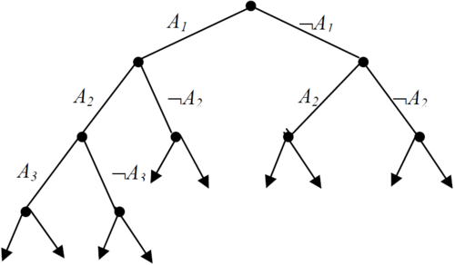

[TOC]

# Глава 3. Метод резолюций

Глава посвящена рассмотрению метода доказательства того, что формула $G​$ является логическим следствием формул $F_1,F_2, ..., F_k​$. Этот метод называется **методом резолюций**. 

> Осторожно, многие определения и бла-бла-блашечки я брал из книги Замятина, там эта глава особенно хорошо для нас подходит. Возможны небольшие расхождения с определениями А.Г., но это не критично. 

Отметим, что задача о логическом следствии сводится к задаче о выполнимости. Действительно, формула $G$ есть логическое следствие формул $F_1, F_2, ..., F_k$ тогда и только тогда, когда множество формул $ \{F_1, F_2, ..., F_k, ¬G\}$ невыполнимо. Метод резолюций, если говорить более точно, устанавливает невыполнимость. **Это первая особенность метода.** 

**Вторая особенность** метода состоит в том, что он оперирует не с произвольными формулами, а с дизъюнктами (или элементарными дизъюнкциями).

## §1. Метод резолюций в логике высказываний

### Основные определения

Рассмотрим вначале логику высказываний. 

<u>Опр.</u> *Напомним*, что **литералом** мы назвали *атомарную формулу или ее отрицание*.

<u>Опр.</u> *Напомним*, что **Дизъюнктом** называли *дизъюнкцию литералов*. 

>  Дизъюнкт может состоять из одного литерала. На дизъюнкт мы иногда будем смотреть, как на множество литералов, т.е. не будем различать дизъюнкты, которые получаются один из другого с помощью коммутативности и ассоциативности дизъюнкции, а также идемпотентности. Последнее означает, например, что дизъюнкты $X \lor \neg Y \lor X$ и $X \lor \neg Y$ равны. 

<u>Опр.</u> **Пустой дизъюнкт** - это дизъюнкт, не содержащий литералов. Обозначение: $\square$.

> А.Г. не использовал этот значок для обозначения пустого дизъюнкта, он вообще не использовал никаких значков (но про пустой дизъюнкт говорил).

<u>Опр.</u> Литералы $L$ и $\neg L$ называются противоположными.

### Метод резолюций для логики высказываний

Метод резолюций в логике высказываний основан на *правиле резолюций*.

Пусть имеется некоторая формула (построенная по алфавиту, введенному в первой главе). Запишем эту формулу в КНФ (выберем любую из них) и отныне будем работать только с этой новой формулой.

Итак, наша фомула представляет из себя выражение вида $F_1\land F_2 \land F_3 \land ...\land F_n$, причем ни одно из выражений $F_i$ конъюнкций не содержит.

> Любую конъюнкивно нормальную форму можно привести к конъюнкции некоторого числа дизъюнкторов. Действительно, повторяющиеся литералы и их отрицания можно исключить из всех выражений $F_i$, используя закон идемпотентности $x_i \lor x_i = x_i $ и закон исключенного третьего $x_i \lor \neg x_i = 1$.

Если выведены формулы $x_i \lor F$ и $\neg x_i \lor G$, то формула $F \lor G$ считается выведенной **методом резолюций**.

Условимся, что выводить какую-либо формулу $G$ из системы дизъюнкторов $\{F_1; F_2; ...; F_n\}$ означает указать такую последовательность дизъюнкторов $\{G_1; G_2; ...; G_m\}$, что каждый дизъюнктор $G_j$ либо совпадает с некоторым дизъюнктором $F_i$ из исходной системы $\{F_i\}, 1 \le i \le n$, либо получен из предыдующих дизъюнкторов этой самой последовательности методом резолюций. Таким образом, под выведенной фомулой $G$ будет подразумеваться самый последний элемент $G_m$ последовательности $\{G_j\}, 1 \le j \le m$.

<u>Обозначение.</u> Метод резолюций обозначается следующим образом: $\frac {x \lor F, \neg x \lor G} {F \lor G}$.

> Естественно будет задаться вопросом о том, для всякой ли системы дизъюнкторов метод резолюций позволяет понять, противоречива она или нет. Убедимся, что это на самом деле так.

### Теорема о полноте метода резолюций в логике высказываний

<u>Теорема</u> (о полноте метода резолюций). Множество дизъюнктов противоречиво тогда и только тогда, когда из него выводим пустой дизъюнкт.

> **Доказательство**. 
>
> Если множество дизъюнктов непротиворечиво, значит, существует интерпретация, в которой они все истинны. Но тогда истинной является и формула, полученная по правилу резолюций. А тогда не может быть выведен пустой дизъюнкт.
>
> Обратно. Доказательство проведём индукцией по количеству различных предметных символов, фигурирующих в записях всех дизъюнктов. Обозначим это количество $n$. Без ограничения общности можно считать, что используемые предметные символы – это $x_1, x_2, …, x_n$.
>
> - **Б.И**. $n = 1$, т.е. все дизъюнкты состоят из одного литерала, каждый из которых $x_1$ или $\neg x_1$. Тогда противоречивость означает, что оба таких литерала присутствуют. Из этой пары выводим пустой дизъюнкт.
>
> - **Ш.И.** Пусть для противоречивых множеств дизъюнктов с числом предметных символов, меньшим $n$, уже доказано. Рассмотрим противоречивое множество $M$ с $n$ предметными символами. Через $M_+$ обозначим множество тех дизъюнктов из $M$, которые не содержат $\neg x_n$, а через $M_-$– множество тех дизъюнктов из $M$, которые не содержат $x_n$. (Вообще говоря, множество $M_+ \cap M_–$ может быть непустым). Через $\widehat{M}_+$ обозначим множество дизъюнктов, получаемых из дизъюнктов множества $M_+$ вычёркиванием символа $x_n$, а через $\widehat{𝑀̂}_-$ - множество дизъюнктов, получаемых из дизъюнктов множества $M_–$ вычёркиванием литерала $\neg x_n$. Покажем, что каждое их этих множеств противоречиво.
>
>   Допустим, что $\widehat{M}_+$ непротиворечиво. Значит, существует такая интерпретация $\varphi$ символов $x_1, x_2, …, x_{n –1}$, при которой каждый дизъюнкт из $\widehat{M} _+$ имеет значение 1. Тогда построим интерпретацию $\varphi^*$ множества $M$ по правилу $\varphi^*(x_i) = \varphi(x_i)$ при $ 1 \leq i \leq n – 1$ и $\varphi^*(x_n) = 0$. Ясно, при интерпретации $\varphi^*$ все дизъюнкты из $M_–$ тоже получат значение 1. Поскольку $M = M_+ \cup M_–$, $\varphi^*$ – интерпретация, при которой все формулы из $M$ получают значение 1. Но $M$ противоречиво!
>
>   Аналогично доказывается, что $\widehat{M}_–$ тоже противоречиво.
>
>   По предположению индукции из $\widehat{M}_+$ выводится пустой дизъюнкт. Это значит, что из $M_+$ по правилу резолюций выводится либо пустой дизъюнкт (и тогда всё доказано), либо $x_n$. 
>
>   Аналогично, из $M_-$ выводится либо пустой дизъюнкт (и тогда всё доказано), либо $\neg x_n$. Но тогда во вторых случаях из $M = M_+ \cup M_–$ выводится $\{x_n, \neg x_n\}$, откуда выводится пустой дизъюнкт.
>   

### Немного практики

Для доказательства того, что формула $G$ является логическим следствием множества формул $F_1, …, F_k$, метод резолюций применяется следующим образом.

Сначала составляется множество формул $T = \{F_1, …, F_k, \neg G\}$. Затем каждая из этих формул приводится к [КНФ](https://ru.wikipedia.org/wiki/Конъюнктивная_нормальная_форма) и в полученных формулах зачеркиваются знаки конъюнкции. Получается множество дизъюнктов $S$. И, наконец, ищется вывод пустого дизъюнкта из $S$. Если пустой
дизъюнкт выводим из $S$, то формула $G$ является логическим следствием формул $F_1, …, F_k$. Если из $S$ нельзя вывести $\square$, то $G$ не является логическим следствием формул $F_1, …, F_k$.

> **Пример**. Покажем, что формула $G = Z$ является логическим следствием формул $F_1 = \neg X \lor Y \rightarrow X \land Z, F_2 = \neg Y \rightarrow Z$. Сформируем множество формул $T = \{F_1, F_2, \neg G\}$. Приведем формулы $F_1$ и $F_2$ к КНФ (формула $\neg G$ сама имеет эту форму). Мы получим, что
> $F_1$ равносильна $X \land (\neg Y \lor Z)$, $F_2$ равносильна $Y \lor Z$.
>
> Тогда множество дизъюнктов $S$ равно $\{ X, \neg Y \lor Z, Y \lor Z, \neg Z \}$. Из множества $S$ легко выводится пустой дизъюнкт: $\neg Y \lor Z, \neg Z, \neg Y, Y \lor Z, Y, \square$.
> Следовательно, формула $G$ является логическим следствием формул $F_1$ и $F_2$. 􀀀

## §2. Подстановки и унификации в логике 1-го порядка

Рассмотрим метод резолюций в логике первого порядка. Относительно переменных в дизъюнктах будем предполагать, что они связаны кванторами общности, но сами кванторы писать не будем. Отсюда следует, что две одинаковые переменные в разных дизъюнктах можно считать различными. 

Заметим, прежде всего, что в логике первого порядка правило резолюций в прежнем виде уже не годится. Действительно, множество дизъюнктов $S = \{P(x), \neg P(a)\}$ невыполнимо (так как предполагается, что переменная $x$ связана квантором общности). В то же время, если использовать правило резолюций для логики высказываний, то из $S$ пустого дизъюнкта не получить. Содержательно понятно, что именно в этом случае надо сделать. Поскольку дизъюнкт $P(x)$ можно прочитать “для любого $x$ истинно $P(x)$”, ясно, что $P(x)$ истинно будет и для $x = a$. Сделав подстановку $х = a$, получим множество дизъюнктов $S'= \{P(a), \neg P(a)\}$. Множества $S$ и $S'$ одновременно выполнимы или невыполнимы. Но из $S'$ пустой дизъюнкт с помощью прежнего правила резолюций выводится тривиальным образом. Этот пример подсказывает, что в логике первого порядка правило резолюций надо дополнить возможностью делать подстановку.

<u>Договоренность.</u> В любой формальной теореме для свободных переменных **подразумевается квантор общности**.

>  Отметим, что даже в самой договоренности оговорено слово "любой", которое могло подразумеваться, то есть быть понятным из контекста предложения.

<u>Опр.</u> Пусть есть формула $F{x_1; x_2; ...; x_n}$. Соответствие (или таблица соответствия) $\sigma: (x_1 \rightarrow t_1; x_2 \rightarrow t_2; ...; x_n \rightarrow t_n)$ называется **подстановкой в некоторый дизъюнктор термов $t_i$ вместо символов $x_i$**.

<u>Обозначение.</u> Результаты подстановок будем обозначать $\sigma(F_i)$.

<u>Опр.</u> Подстановка $\sigma$ называется **унификацией** для данной системы , если результаты применения этой подстановки ко всем дизъюнкторам совпадают между собой, то есть выполнено равенство $\sigma(F_1)=\sigma(F_2)=...=\sigma(F_n)$.

>  **Пример 1.** Для системы $\{f^0x_1f^1(x_2);x_3x_4x_5\}$ подстановка $(x_3 \rightarrow f^0; x_4 \rightarrow x_2; x_5 \rightarrow f^1(x_2))$ является унификатором.
>
>  **Пример 2**. Система $\{x_1f^1(x_1);x_2x_2\}$ не унифицируема.

<u>Опр.</u> Унификатор $\tau$ называется **универсальным в данной системе дизъюнкторов**, если для любой подстановки $\sigma$ верно $\tau(F) = (\tau \circ \sigma)(F) = \tau(\sigma(F))$.

<u>Теорема</u> (о существовании универсального унификатора для системы дизъюнкторов). Если система дизъюнкторов унифицируема, то для нее существует универсальный унификатор.

> **Доказательство.**
>
> $\forall a \forall b (a \in R \land a \geq 0 \land b \in R \land B \geq 0 \rightarrow \frac{a+b}{2} \geq \sqrt{ab})$
>
> | $\forall a \forall b (a \in R \land a \geq 0 \land b \in R \land B \geq 0 \rightarrow \frac{a+b}{2} \geq \sqrt{ab})$ | Что и как делаем                                             |
> | ------------------------------------------------------------ | ------------------------------------------------------------ |
> | $a \in R, a \geq 0, b \in R, b \geq 0$                       | Теорема дедукции                                             |
> | $\exists c \in R: a = c^2 \land c \geq 0\\ \exists d \in R: b = d^2 \land d \geq 0$ | Теорема о полноте. $\forall x \geq 0 \exists y \geq 0 y^2 = x$ подстановка[] |
> | $c - d \in R$                                                | Свойство $R$ как кольца. $\forall x, y \in R \rightarrow x -y \in R$ - подстановка |
> | $(c - d) ^2 \geq 0$                                          | $\forall x \in R \rightarrow x^2 \geq 0 $ подстановка        |
> | $c^2 - 2cd + d^2 \geq 0$                                     |                                                              |
> | $\frac{c^2 + d^2}{2} = cd$                                   | $\forall x \in R \rightarrow x^2 \geq 0 $ подстановка $\sqrt{x}\sqrt{y} = \sqrt{xy}$ |
> |                                                              |                                                              |
> |                                                              |                                                              |
>
> Подстановка. Принято писать не так: $x_i \rightarrow t_i$, а вот так: $x_i | t_i$
>
> Подстановка $\sigma$ это такой набор предметных переменных: $\sigma = \{x_{i_1} | t_1, x_{i_2} | t_2 ... x_{i_n}\}$, где $x_{j_k} \neq t_k$
>
> $\tau = \{x_{j_1} | s_1, x_{j_2}| s_2 ... x_{j_n} | s_m\}$
>
> $\sigma \circ \tau$
>
> 1. ${x_{i_1} | t_1^{\sigma} | x_{i_2}}$
> 2. вычеркиваем для $x_{j_k} = x_{i_l}$
> 3. вычеркиваем, если $r_k^{\sigma} = x_{j_k}$
>
> $\sigma = \{x_1 | x_2 , x_2 | f^2_1 x_1 x_3, x_3 | f_1^0\}$
>
> $\tau = \{x_1 | f_1^1 , x_2, x_2 | x_1, x_3 | x_4, x_4 | x_3\}$

==Вероятно, параграф 3==

## §3. Метод резолюций для логики первого порядка

> Нам необходимо иметь возможность унифицировать некоторые дизъюнкты, чтобы иметь возможность их вычеркивать для получения какого-то результата.

<u>Опр.</u> Пусть имеется 2 дизъюнкта

$P_1^n t_1 ... t_n \lor F, \neg P_1^n s_1...s_n \lor G$

$s_1, ...s_n$ - какие-то термы

$\sigma$ - унификатор $p_1^nt_1... t_n$ и $p_1^ns_1..s_n$

Бинарной резольветой называется дизъюнкт $F^{\sigma} \lor G^{\sigma}$.

>  Пример. 
>
> 1. $\neg P_1^2 f_1^0 f_1^1 x_1 \lor P_1^1x_1$
> 2. $P_1^2  x_2 x_3 \lor \neg P_2^1 x_3$
>
> $\sigma = \{x_2 | f_1^0, x_3 | f_1^1 x_1\}$
>
> $\neg P_1^2 f_1^0 f_1^1 x_1 \lor P_1^1 x_1$
>
> $P_1^2 f_1^0 f_1^1 x_1 \lor \neg P_2^1 f_1^1 x_1$

<u>Опр.</u> Рассмотрим дизъюнкт: 

операция склейка

> Пример. $\neg P_1^2 x_1 x_2 \lor \neg P_1^2 x_2 x_1 \lor \neg P_1^2 f_1^0 f_1^0 \lor P_2^3 x_1 x_2 x_3$
>
> $\sigma = \{x_1 | f_1^0, x_2 | f_1^0\}$
>
> $\neg P_1^2 f_1^0 f_1^0 \lor P_2^3 f_1^0 f_1^0 x_3$

Опр. что такое резольвента

Пусть имется 2 дизъюнкта: $L_1 \lor F$ и $L_2 \lor G$. Резольвентой называется следующее: если мы к одному из них применяем склейку, либо к обеим, либо ни к чему, а потом правило резолюции. 

<u>Опр.</u> Пусть имеется набор дизъюнктов $D_1, D_2, ..., D_n$, если построится такая цепочка $G_1, G_2, .. G_m = F$, что каждый элемент цепочки либо один из дизъюнктов, либо получен из предыдущих дизъюнктов по правилу резольвенты.

> Исходных дизъюнктов n, а сколько в результате получится понятия не имею 

>  Пример. 
>
> $D_1 = \neg P_1^1 x_1 \lor \neg P_2^1 x_1 \lor P_3^1 f_1^1 x_1$
>
> $D_2 = P_1^1 x_2 \lor P_3^1 f_1^1 x_3$
>
> $D_3 = P_1^1 f_1^0$
>
> $\sigma = \{x_1 | f_1^0\}$
>
> $\neg P_1^1 f_1^0 \lor \neg P_2^1 f_1^0 \lor P_3^1 $ какая-то непонятная дичь

Опр. Когда некоторому дизъюнкту применяется подставноку, то результат называется примером данного дизъюнкта. $D^{\sigma}$ - пример дизъюнкта D.

<u>Теорема</u> (лемма о подъеме). Пусть $D'_1$ - это пример дизъюнкта $D_1, D_2'$  - пример дизъюнкта $D_2$. $D'$ - резольвента $D_1'$ и $D'_2$, тогда существует резольвента $D$ для $D_1 $ и $D_2$, для которой $D'$ является примером. 

> Почему лемма о подъеме, Куда поднимаемся? 
>
> **Доказательство.**
>
> <u>Замятин, страница 107</u>
>
> Можем считать, что в $D_1$ и $D_2$ нет общих переменных символов. Тогда мы можем считать, что есть общая подстановка $\sigma = \sigma_1 \circ \sigma_2$. 
>
> рисунок - не рисунок. кек. почему нет $\sigma_1 и \sigma_2​$ .

## §4. Эрбранов универсум множества дизъюнктов

$S$ - множество дизъюнктов

$H_0$ - множество функционалных символов арности 0, котоые встречаются в записи этих дизъюнктов  

Если таких нет, то насильно помещаем туда любой арности 0 (с любой нам удобной интерпретацией)

Допустим, что построено $H_i$. Тогда строим $H_{i+1}$ следующим образом: берем все функциональные символы ненулевой арности, и для каждого $f_j^k$   берем  $f_j^kt_1\dots t_k, t_1\dots t_k \in H_i$

(Т. е. $H_i$ - всегда множество термов)

$H_\infty =  \displaystyle\bigcup_{i \geq 0} H_i$ - универсум

Пример:

$S_1=\{P_1^0\or P_1^1x_1, \neg P_1^1x_2 \or P_2^1f_1^1 x_1, \neg P_2^1 f_1^1f_1^0\}$

$H_0 = \{f_1^0\}$

$H_1 = \{f_1^0, f_1^1f_1^0\}$

$H_2 = \{f_1^0, f_1^1f_1^0, f_1^1f_1^1f_1^0\}$

$H_\infty = \{f_1^0,f_1^1f^0_1,f_1^1f_1^1f_1^0,\dots, f_1^1\dots f_1^1f_1^0, \dots\}$

$S_2= \{P_1^1x_1,\neg P_2^1x_1 \or P_3^1 x_2\}$

$H_0 = \{f_1^0\} = H_1 =H_2=\dots=H_\infty$

$S_3 = \{P_1^1x_1, \neg F_1^1 f_2^0 \or P_2^2x_2f_1^2x_2f_1^0\}$

$H_0 = \{f_1^0, f_2^0\}$

$H_1= \{f_1^0,\  f_2^0, \ f_1^2f_1^0f_1^0,\ f_1^2f_1^0f_2^0, \ f_1^2f_2^0f_1^0,\  f_1^2f_2^0f_2^0\}$

$H_2 = \{\dots, \ \}$

**Эрбранов базис** - Множество всех атомарных формул $P_n^mt_1t_2\dots t_m,\quad P_n^m\in S,\quad t_i \in H_\infty$

Пример:

$B_1:\ \{P_1^0,\ P_1^1f_1^0,\ P_1^1f_1^1f_1^0,\ \dots,\  P_1^1f_1^1\dots f_1^1,\ P_2^1f_1^0,\ P_2^1f_1^1f_1^0,\ \dots,\  P_2^1f_1^1\dots f_1^1f_1^0\}$

$B_2=\{P_1^1f_1^0,\ P_2^1f_1^0,\ P_3^1f_1^0\}$

Мы хотим построить модель, в которой в качетсве носителя выступает эрбранов базис

Вспомним, что модель $M = \{A, \Sigma, \mu\}$, где 

$A$ - множество - носитель,

$\Sigma$ - множество операций и отношений на $A$ - сигнатура,

$\mu: F \to P$ ???

Модель $M = \{H_\infty, \Sigma, \mu_\zeta\}$ - **универсальная эрбранова $(UH)$ модель**

$\zeta: ($Элемент эрбранова базиса$) \to \{$"0", "1"$\}$

$\zeta(P_1^m t_1\dots t_m)$

Для каждой модели построим соответствующую универсальную эрбранову модель:

Берем $P_n^mt_1t_2\dots t_m$ - произвольную атомарную формулу, смотрим, какие в ней встречаются переменные $x_{i_1},\dots x_{i_k}$

$\sigma = \{x_{i_1}|s_{i_1},\dots,x_{i_k}|s_{i_k}\}, \quad s_{i_1},\ \dots,\ s_{i_k} \in H_\infty$

$(P_n^mt_1\dots t_m)^\sigma \in B$

$\zeta(P_n^mt_1\dots t_m) = 1$, если интерпретация этой формулы принимает значение 1

$A = \{a,b,c\}\quad \Sigma=\{f_1^0,\ f_1^1,\ P_1^0,\ P_1^1,\ P_2^1\}$

|      | $f_1^0$ | $f_1^1$ | $P_1^0$ | $P_1^1$ | $P_2^1$ |
| :--: | :-----: | :-----: | :-----: | :-----: | :-----: |
|  a   |    b    |    b    |    1    |    1    |    1    |
|  b   |    b    |    c    |    1    |    0    |    1    |
|  c   |    b    |    a    |    1    |    0    |    0    |

$A​$ = универсум той модели

|                        | $f_1^0$ |           $f_1^1$           | $P_1^0$ | $P_1^1$ | $P_1^2$ |
| :--------------------: | :-----: | :-------------------------: | :-----: | :-----: | :-----: |
|        $f_1^0$         | $f_1^0$ |        $f_1^1f_1^0$         |    1    |    0    |    1    |
|      $f_1^1f_1^0$      | $f_1^0$ |      $f_1^1f_1^1f_1^0$      |    1    |    0    |    0    |
|   $f_1^1f_1^1f_1^0$    | $f_1^0$ |   $f_1^1f_1^1f_1^1f_1^0$    |    1    |    1    |    1    |
| $f_1^1f_1^1f_1^1f_1^0$ | $f_1^0$ | $f_1^1f_1^1f_1^1f_1^1f_1^0$ |    1    |    0    |    1    |
|        $\dots$         | $f_1^0$ |                             |    1    |         |    0    |

<u>Теорема 1</u>. Пусть все дизъюнкты из $S$ истинны в некторой модели $M$. Тогда для любой интерпретации UH - модели эти дизьюнкты также истинны.

"Очевидно"

<u>Теорема 2</u>. Множество дизьюнктов $S$ не выполнимо тогда, и только тогда, когда оно не выполнимо ни в какой UH - модели.

> Если оно не выполнимо ни в какой модели, то и в универсальной.
>
> Если оно выполнимо в какой-либо модели, то в соответствующей универсальной модели таже принимает значение 1 по предыдущей теореме.

## §5. Семантические деревья, теорема Эрбрана

==Тут нет большого куска!!! (Конец второго??? 3ий параграф??? Четвёртый и начало пятого!!!)==

*16 апреля*

Пусть $G$ - ориентированное дерево, у которого степень каждой вершины конечно.

<u>Теорема</u> (*Лемма Кёнига*): если $G$ бесконечно, то существует бесконечный путь, начинающийся от корня

> Начнём путь от корня. Из каждой вершины - бесконечное количество рёбер. Готово. $\square$

<u>Опр</u>.  $G$ называется **эрбрановым деревом**, если:

1. Путь от корня до люой вершины конечен;
2. На каждом ребре есть метка в виде элемента эрбранова базиса или его отрицания;
3. Ни на каком пути не встречается противоположных литералов;
4. Если из некоторой вершины выходят рёбра с разметкой $F_1, F_2, ..., F_k$ то $F_1 \lor F_2  \lor ...  \lor F_k =$  истина

<u>Опр</u>. Эрбраново дерево **полное**, если на любом максимальном пути для каждого элемента эрбранова базиса либо сам элемент, либо его отрицание встречается на этом пути.

> Эти деревья - неполные, потому что....
>
> Рис.2 - не замкнуто

<u>Опр</u>. **Пример дизьюнкта** - в дизъюнкт выполнена подстановка. *Основным примером* дизъюнкта является подстановка в этот дизъюнкт элементов эрбранова универсума (на место всех переменных)

<u>Опр</u>. Вершина дерева называется **опровергающей** данный дизъюнкт, если конъюнкция всех литералов стоящих до данной вершины и основного примера есть ложь. Самая *близкая* к корню опровергающая вершина называется **максимальной**.

$S_1 = {P^1_1x_1, \neg P^1_1x_2 \lor P^1_2 f^1_1x_1, \neg P^1_2 f^1_1 f^0_1}$

<u>Опр</u>. **Обрезанием** эрбранова дерева называется удаление всех вершин, стоящих после максимальной опровергающей вершины.

<u>Опр</u>. Эрбраново дерево называется **замкнутым**, если все его листы являются максимальными опровергающими вершинами. Становится таковым после обрезания.

<u>Теорема</u> (*Эрбрана*): множество дизъюнктов $S$ невыполнимо тогда и только тогда, когда  любое полное эрбраново дерево [для этого множества дизъюнктов] после обрезания становится конечным.

> $\Rightarrow S$ - невыполнимо. Тогда для любой $H$ интерпретации найдётся ложный дизъюнкт. Ложный дизъюнкт это основной пример => есть опровергающая вершина, в том числе максимальная. Любая интерпретация - путь в дереве, на каждом из которых встретится максимальная опровергающая вершина. Выполним обрезание дерева. Получается, что из начальной вершины любой путь конечен => всё дерево конечно.
>
> $\Leftarrow$ Все полные эрбрановы деревья были обрезаны и оказались конечны. Это значит, что мы на каждом пути нашли максимальную опровергающую вершину. После этого каждый путь заканчивается на основной пример. Какую бы интерпретацию мы не взяли, у нас найдётся дизъюнкт, который стал ложным. Значит, S невыполнимо в любой H интерпретации. $\square$
>

## §6. Теорема о полноте метод резолюций, на языке первого порядка

В этом параграфе мы только докажем теорему о полноте.

<u>Теорема</u>. Множество дизъюнктов $S$ невыполнимо тогда и только тогда, когда из него выводится пустой дизъюнкт.

> $\Rightarrow$ **Необходимость**
>
> Пусть множество дизъюнктов $S$ невыполнимо и $B = \{A_1, A_2, …, A_n, …\}$ – эрбрановский базис для $S$. Рассмотрим полное семантическое дерево $T$.
>
> 
>
> По теореме Эрбрана $T$ содержит конечное замкнутое семантическое поддерево $T'$. Если $T'$ состоит только из корня, то $\square \in S$, и поэтому $\square$ выводим из $S$. Предположим, что $T'$ состоит не только из корня. Тогда $T'$ имеет вершину $v$, потомки $v_1$ и $v_2$ которой являются максимальными опровергающими для множества $S$ вершинами. Пусть
>
> $I(v) = \{ L_1, L_2, …, L_k\}$ ,
> $I(v_1) = \{ L_1, L_2, …, L_k, A_{k+1}\}$,
> $I(v_2) = \{ L_1, L_2, …, L_k, \neg A_{k+1} \}$
>
> Существует дизъюнкт $D_1 \in S$ такой, что его основной пример $D_1$ опровергается в $I(v_1)$, и существует дизъюнкт $D_2 \in S$ такой, что его основной пример $D_2$ опровергается в $I(v_2)$. Так как дизъюнкты $D_1$ и $D_2$ не опровергаются в $I(v)$, то $D_1$ содержит $\neg A_{k+1}$, а $D_2$ − $A_{k+1}$. Применим к $D_1$  и $D_2$ правило резюлюций, отрезая литералы $\neg A_{k+1}$ и $A_{k+1}$, получим дизъюнкт $D'$:
>
> $D' = (D_1' – \neg A_{k+1}) \cup (D_2' –A_{k+1})$.
>
> Отметим, что дизъюнкт $D_1' − ¬A_{k+1}$ ложен в $I(v)$, поскольку в противном случае, $D_1'$ был бы истинен в $I(v_1)$. Аналогично заключаем, что $D_2' – A_{k+1}$ ложен в той же интерпретации $I(v)$. Отсюда следует, что $D'$ ложен при $I(v)$.
>
> По лемме о подъеме (ссылка) существует дизъюнкт $D$, который является резольвентой дизъюнктов $D_1$ и $D_2$. Ясно, что $D$ опровергается в $I(v)$. Рассмотрим множество дизъюнктов $S \cup \{D\}$. Замкнутое семантическое дерево $T''$ для этого множества дизъюнктов можно получить вычеркиванием некоторых вершин (и идущих в них дуг) дерева $T'$. А именно, в дереве $T'$ вычеркиваем все дуги и вершины, которые лежат ниже первой (на пути из корня) вершины, где дизъюнкт $D'$ ложен. Полученное таким образом дерево $T''$ содержит меньше вершин, нежели дерево $T'$, так как $v_1, v_2 \notin T''$.
>
> Применим описанный выше процесс к $T''$, мы получим резольвенту дизъюнктов из $S \cup \{D\}$. Расширим множество $S \cup \{D\}$ за счет этой резольвенты, придем к конечному замкнутому дереву с меньшим числом вершин, нежели $T''$. В конце концов, получим замкнутое семантическое дерево, состоящее только из корня. Это возможно, лишь в случае, когда множество $S$, расширенное резольвентами, содержит пустой дизъюнкт, Следовательно, $\square$ выводим из $S$. Необходимость условия теоремы доказана.
>

> $\Leftarrow$ **Достаточность**
>
> Пусть пустой дизъюнкт выводим из $S$, и $D_1, D_2, …, D_n = \square$ – вывод из $S$. Предположим, что $S$ выполнимо в некоторой интерпретации. Тогда, поскольку правило резолюций и правило склейки сохраняют истинность, то все дизъюнкты вывода, в том числе и пустой, являются истинными в этой интерпретации. Полученное противоречие доказывает, что $S$ невыполнимо. 

<u>Теорема</u> (следствие из теоремы о полноте). Если для множества формул $S$ каждое конечное подмножество выполнимо, то и всё множество формул $S$ выполнимо.

> Эта теорема называется теоремой [Мальцева](https://ru.wikipedia.org/wiki/Мальцев,_Анатолий_Иванович) о компактности.

### Немного бла-бла

Рассмотрим следующую модель, а именно объекты вида: $F_n = \exists x \{0 < x < \frac{1}{n}\}$. Эти объекты назвали нестандартными, а саму модель - [нестандартный анализ](https://ru.wikipedia.org/wiki/Нестандартный_анализ). Он может быть полезен при получении целого ряда теорем, которые с помощью обычного анализа получаются очень сложно. 

> *«Есть веские основания считать, что нестандартный анализ, в той или иной форме, станет анализом будущего»* — [Курт Гёдель](https://ru.wikipedia.org/wiki/%D0%9A%D1%83%D1%80%D1%82_%D0%93%D1%91%D0%B4%D0%B5%D0%BB%D1%8C), 1973 год. 

#### P.S.

Глава закончилась, а мы так и не прошли стратегии методов резолюций. Этот раздел А.Г. оставил нам на самостоятельное изучение :slightly_smiling_face:, но спрашивать он его на экзамене не будет.